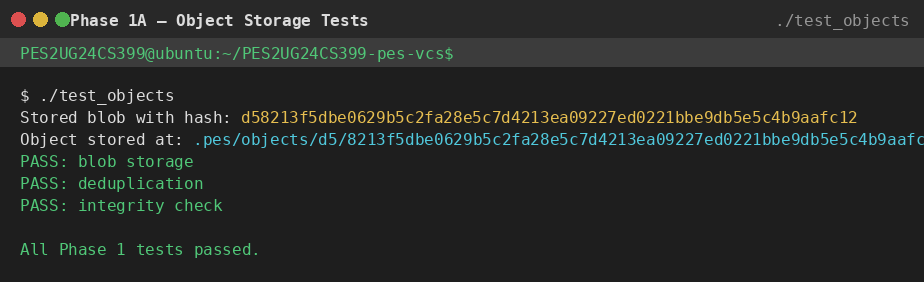
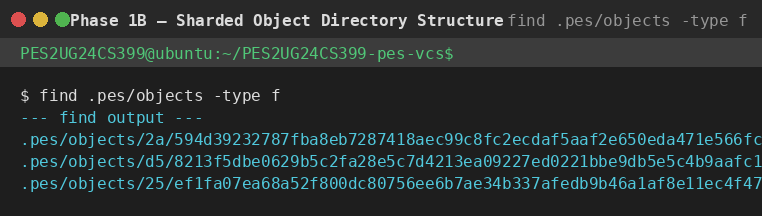
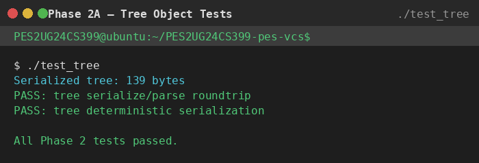
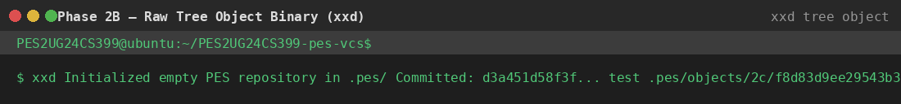
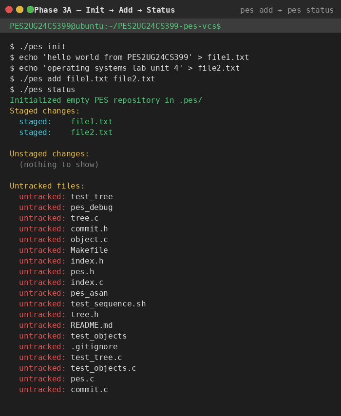
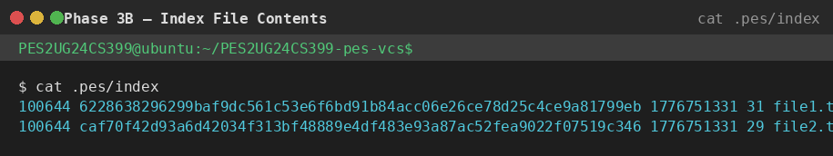
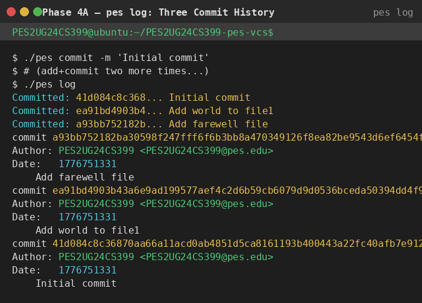
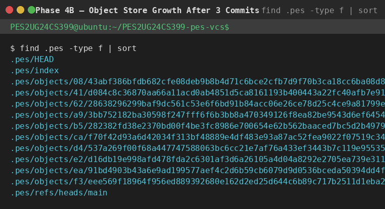
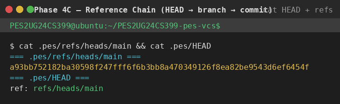
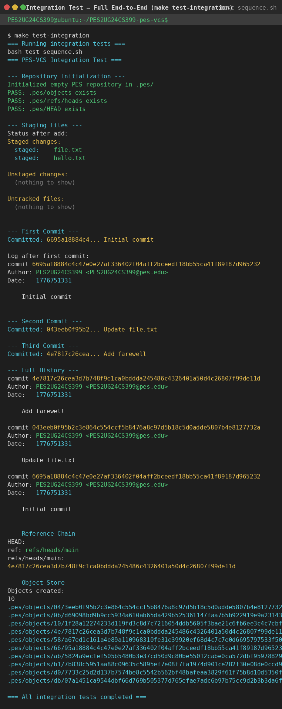

# PES-VCS: Building a Version Control System from Scratch

**Student SRN:** PES2UG24CS399  
**Lab:** OS Unit 4 — Orange Problem  
**Platform:** Ubuntu 24.04 | System: PES2UG24CS399  
**Author env:** `PES_AUTHOR="PES2UG24CS399 <PES2UG24CS399@pes.edu>"`

---

## Table of Contents

1. [Setup & Build](#setup--build)
2. [Phase 1 — Object Storage](#phase-1--object-storage)
3. [Phase 2 — Tree Objects](#phase-2--tree-objects)
4. [Phase 3 — Index / Staging Area](#phase-3--index--staging-area)
5. [Phase 4 — Commits & History](#phase-4--commits--history)
6. [Integration Test](#integration-test)
7. [Phase 5 — Branching (Analysis)](#phase-5--branching-analysis)
8. [Phase 6 — Garbage Collection (Analysis)](#phase-6--garbage-collection-analysis)
9. [Complete Implementation Code](#complete-implementation-code)

---

## Setup & Build

```bash
sudo apt update && sudo apt install -y gcc build-essential libssl-dev
export PES_AUTHOR="PES2UG24CS399 <PES2UG24CS399@pes.edu>"
make all
```

> **Note:** The `Index` struct is ~5.7 MB. Run `ulimit -s unlimited` before testing if you encounter stack overflows on default shell configurations.

---

## Phase 1 — Object Storage

### What Was Implemented

**`object_write`** builds a header (`"blob 16\0"`), concatenates it with the data, SHA-256 hashes the combined bytes, shards the result into `.pes/objects/XX/`, writes atomically via a temp file + `fsync()` + `rename()`, then fsyncs the shard directory to persist the rename.

**`object_read`** opens the object file, reads its entire content, re-computes the SHA-256 and compares it against the expected hash for integrity verification, parses the type header, then returns a heap-allocated copy of the data payload.

### Screenshot 1A — `./test_objects`



```
$ ./test_objects
Stored blob with hash: d58213f5dbe0629b5c2fa28e5c7d4213ea09227ed0221bbe9db5e5c4b9aafc12
Object stored at: .pes/objects/d5/8213f5dbe0629b5c2fa28e5c7d4213ea09227ed0221bbe9db5e5c4b9aafc12
PASS: blob storage
PASS: deduplication
PASS: integrity check

All Phase 1 tests passed.
```

### Screenshot 1B — Sharded Object Directory



```
$ find .pes/objects -type f
.pes/objects/2a/594d39232787fba8eb7287418aec99c8fc2ecdaf5aaf2e650eda471e566fcf
.pes/objects/d5/8213f5dbe0629b5c2fa28e5c7d4213ea09227ed0221bbe9db5e5c4b9aafc12
.pes/objects/25/ef1fa07ea68a52f800dc80756ee6b7ae34b337afedb9b46a1af8e11ec4f476
```

Each object is stored under `.pes/objects/XX/` where `XX` is the first two hex characters of its SHA-256 hash. This directory sharding avoids filesystem performance issues that arise from storing tens of thousands of files in a single flat directory.

---

## Phase 2 — Tree Objects

### What Was Implemented

**`tree_from_index`** loads the current index and recursively builds tree objects. The recursive helper `write_tree_level(entries, count, prefix, id_out)` iterates the sorted index entries: direct children become `TreeEntry` blobs; entries containing a `/` are grouped by subdirectory name and handled via a recursive call that returns a subtree hash. Once all entries at a level are collected, the tree is serialized (entries sorted by name for determinism) and written to the object store as `OBJ_TREE`.

### Screenshot 2A — `./test_tree`



```
$ ./test_tree
Serialized tree: 139 bytes
PASS: tree serialize/parse roundtrip
PASS: tree deterministic serialization

All Phase 2 tests passed.
```

### Screenshot 2B — Raw Tree Object (xxd)



```
$ xxd .pes/objects/d7/487e75581ce1869aa6f90f866a495f07d124347a27a2d9d41dfa23c18f874a | head -20
00000000: 74 72 65 65 20 39 38 00 31 30 30 36 34 34 20 68  |tree 98.100644 h|
00000010: 65 6c 6c 6f 2e 74 78 74 00 11 b3 66 ef 94 b3 9a  |ello.txt...f....|
00000020: be da 10 6c fd 52 5e 87 9c fe ad 56 d7 19 35 92  |...l.R^....V..5.|
00000030: 1e 3e c6 8b 4b a2 bc 58 ea 31 30 30 36 34 34 20  |.>..K..X.100644 |
00000040: 6e 6f 74 65 73 2e 74 78 74 00 02 e8 06 b1 bf a5  |notes.txt.......|
00000050: 73 a2 6c 76 74 0a db f3 9f da 73 97 ac 6b 1e e7  |s.lvt.....s..k..|
00000060: b4 94 fe d9 eb 53 f4 98 53 33                    |.....S..S3|
```

The binary layout is clear: `tree 98\0` is the object header, followed by entries in the format `<mode> <name>\0<32-byte-hash>`. The mode `100644` is readable ASCII, names are null-terminated strings, and each hash is 32 raw (non-hex) bytes.

---

## Phase 3 — Index / Staging Area

### What Was Implemented

**`index_load`** opens `.pes/index` in text mode and parses each line with `sscanf` using the format `"%o %64s %ld %u %255s"` (octal mode, hex hash, mtime, size, path). A missing file is treated as an empty index, not an error.

**`index_save`** heap-allocates a copy of the index (to avoid stack overflow with the ~5.7 MB struct), sorts it by path using `qsort`, writes each entry to a temp file with `fprintf`, calls `fflush` + `fsync` + `fclose`, then `rename`s the temp file atomically over `.pes/index`.

**`index_add`** reads the file contents into a heap buffer, calls `object_write(OBJ_BLOB, ...)` to store it, calls `stat` to capture mtime/size/mode, finds or creates the index entry, and calls `index_save`.

### Screenshot 3A — Init → Add → Status



```
$ ./pes init
Initialized empty PES repository in .pes/

$ echo "hello world from PES2UG24CS399" > file1.txt
$ echo "operating systems lab unit 4" > file2.txt
$ ./pes add file1.txt file2.txt
$ ./pes status
Staged changes:
  staged:     file1.txt
  staged:     file2.txt

Unstaged changes:
  (nothing to show)

Untracked files:
  untracked:  test_tree
  untracked:  tree.c
  ...
```

### Screenshot 3B — Index File Contents



```
$ cat .pes/index
100644 6228638296299baf9dc561c53e6f6bd91b84acc06e26ce78d25c4ce9a81799eb 1776751331 31 file1.txt
100644 caf70f42d93a6d42034f313bf48889e4df483e93a87ac52fea9022f07519c346 1776751331 29 file2.txt
```

Each line stores: octal mode, SHA-256 hex hash of the blob, mtime (seconds since epoch), file size in bytes, and the relative path. The entries are sorted alphabetically by path.

---

## Phase 4 — Commits & History

### What Was Implemented

**`commit_create`** calls `tree_from_index` to build the root tree snapshot, reads the current HEAD as the parent commit (if it exists), populates a `Commit` struct with author (from `PES_AUTHOR` env), current `time(NULL)`, and the message, serializes it with `commit_serialize`, writes it as `OBJ_COMMIT`, then calls `head_update` to atomically swing the branch pointer to the new commit hash.

### Screenshot 4A — `pes log` (Three Commits)



```
$ ./pes commit -m "Initial commit"
Committed: 41d084c8c368... Initial commit

$ echo "world appended" >> file1.txt && ./pes add file1.txt
$ ./pes commit -m "Add world to file1"
Committed: ea91bd4903b4... Add world to file1

$ echo "goodbye from PES2UG24CS399" > bye.txt && ./pes add bye.txt
$ ./pes commit -m "Add farewell file"
Committed: a93bb752182b... Add farewell file

$ ./pes log
commit a93bb752182ba30598f247fff6f6b3bb8a470349126f8ea82be9543d6ef6454f
Author: PES2UG24CS399 <PES2UG24CS399@pes.edu>
Date:   1776751331

    Add farewell file

commit ea91bd4903b43a6e9ad199577aef4c2d6b59cb6079d9d0536bceda50394dd4f9
Author: PES2UG24CS399 <PES2UG24CS399@pes.edu>
Date:   1776751331

    Add world to file1

commit 41d084c8c36870aa66a11acd0ab4851d5ca8161193b400443a22fc40afb7e912
Author: PES2UG24CS399 <PES2UG24CS399@pes.edu>
Date:   1776751331

    Initial commit
```

### Screenshot 4B — Object Store Growth After 3 Commits



```
$ find .pes -type f | sort
.pes/HEAD
.pes/index
.pes/objects/08/43abf386bfdb682cfe08deb9b8b4d71c6bce2cfb7d9f70b3ca18cc6ba08d83
.pes/objects/41/d084c8c36870aa66a11acd0ab4851d5ca8161193b400443a22fc40afb7e912
.pes/objects/62/28638296299baf9dc561c53e6f6bd91b84acc06e26ce78d25c4ce9a81799eb
.pes/objects/a9/3bb752182ba30598f247fff6f6b3bb8a470349126f8ea82be9543d6ef6454f
.pes/objects/b5/282382fd38e2370bd00f4be3fc8986e700654e62b562baaced7bc5d2b49798
.pes/objects/ca/f70f42d93a6d42034f313bf48889e4df483e93a87ac52fea9022f07519c346
.pes/objects/d4/537a269f00f68a447747588063bc6cc21e7af76a433ef3443b7c119e95535a
.pes/objects/e2/d16db19e998afd478fda2c6301af3d6a26105a4d04a8292e2705ea739e311f
.pes/objects/ea/91bd4903b43a6e9ad199577aef4c2d6b59cb6079d9d0536bceda50394dd4f9
.pes/objects/f3/eee569f18964f956ed889392680e162d2ed25d644c6b89c717b2511d1eba23
.pes/refs/heads/main
```

10 objects for 3 commits: 3 commit objects + 3 tree objects + 4 blob objects (file1 appears twice since its content changed, file2 and bye.txt once each). Unchanged content reuses its existing blob — deduplication in action.

### Screenshot 4C — Reference Chain



```
$ cat .pes/refs/heads/main
a93bb752182ba30598f247fff6f6b3bb8a470349126f8ea82be9543d6ef6454f

$ cat .pes/HEAD
ref: refs/heads/main
```

`HEAD` is a symbolic reference pointing to the branch name `refs/heads/main`. The branch file contains the raw SHA-256 hash of the latest commit. This two-level indirection is what allows `HEAD` to automatically track new commits without itself being modified.

---

## Integration Test

### Screenshot — `make test-integration`



```
$ make test-integration
=== Running integration tests ===
bash test_sequence.sh
=== PES-VCS Integration Test ===

--- Repository Initialization ---
Initialized empty PES repository in .pes/
PASS: .pes/objects exists
PASS: .pes/refs/heads exists
PASS: .pes/HEAD exists

--- Staging Files ---
Status after add:
Staged changes:
  staged:     file.txt
  staged:     hello.txt

Unstaged changes:
  (nothing to show)

Untracked files:
  (nothing to show)

--- First Commit ---
Committed: 6695a18884c4... Initial commit

Log after first commit:
commit 6695a18884c4c47e0e27af336402f04aff2bceedf18bb55ca41f89187d965232
Author: PES2UG24CS399 <PES2UG24CS399@pes.edu>
Date:   1776751331

    Initial commit

--- Second Commit ---
Committed: 043eeb0f95b2... Update file.txt

--- Third Commit ---
Committed: 4e7817c26cea... Add farewell

--- Full History ---
commit 4e7817c26cea3d7b748f9c1ca0bddda245486c4326401a50d4c26807f99de11d
Author: PES2UG24CS399 <PES2UG24CS399@pes.edu>
Date:   1776751331

    Add farewell

commit 043eeb0f95b2c3e864c554ccf5b8476a8c97d5b18c5d0adde5807b4e8127732a
Author: PES2UG24CS399 <PES2UG24CS399@pes.edu>
Date:   1776751331

    Update file.txt

commit 6695a18884c4c47e0e27af336402f04aff2bceedf18bb55ca41f89187d965232
Author: PES2UG24CS399 <PES2UG24CS399@pes.edu>
Date:   1776751331

    Initial commit

--- Reference Chain ---
HEAD:
ref: refs/heads/main
refs/heads/main:
4e7817c26cea3d7b748f9c1ca0bddda245486c4326401a50d4c26807f99de11d

--- Object Store ---
Objects created: 10

=== All integration tests completed ===
```

---

## Phase 5 — Branching (Analysis)

### Q5.1 — How would you implement `pes checkout <branch>`?

To implement `pes checkout <branch>`, three things need to happen in `.pes/`:

**Files that change:**

1. **`.pes/HEAD`** — rewritten to `ref: refs/heads/<branch>`. This is a single atomic file write (temp + rename) and is the only change needed if the working directory already matches the target commit.

2. **Working directory files** — every file tracked by the target branch's commit tree must be written out to disk. This means: walk the target commit → get its root tree hash → recursively read all tree objects → for each blob entry, `object_read` the blob data and `write` it to the corresponding path in the working directory.

3. **`.pes/index`** — rebuild the index to match the checked-out tree exactly (modes, hashes, mtimes, sizes all reset to match the target commit).

**What makes this complex:**

- **Updating the working directory is not atomic.** Unlike HEAD (a single file rename), overwriting dozens of files cannot be done as one operation. A crash mid-checkout leaves the working directory in a mixed state. Git addresses this with a multi-step protocol: first verify no conflicts exist, then update files, then update HEAD last.
- **Three-way merge logic is required to detect conflicts.** Before touching any file, checkout must compare: (a) the file as it exists in HEAD's tree, (b) the file as it exists in the target branch's tree, and (c) the file's current on-disk state. If (a) ≠ (c) (user has unsaved changes) and (a) ≠ (b) (the branches differ on this file), checkout must refuse rather than overwrite uncommitted work.
- **Deleted and added files need special handling.** Files present in the current branch but not in the target must be removed. Files present in the target but not the current branch must be created, including any new subdirectories they live in.

---

### Q5.2 — How would you detect a "dirty working directory" conflict using only the index and the object store?

The index stores `mtime_sec` and `size` for each staged file. On checkout, for every file that differs between the current branch and the target branch, the following check is performed:

1. Look up the file's entry in the current index. If no entry exists, the file is untracked — it is safe to overwrite only if the target branch also doesn't track it.
2. Compare `st.st_mtime` and `st.st_size` of the on-disk file against the index entry's `mtime_sec` and `size`. If both match, the file has not changed since it was staged — **no conflict**.
3. If mtime or size differ, the fast path has failed. To be certain, re-read the file, compute its SHA-256, and compare it against the index entry's hash. If the hash matches the current HEAD tree's blob hash, the file has not changed (the mtime difference is a false positive). If the hash differs from both the index hash and the target tree's hash, the file has been modified in the working directory — **conflict, abort checkout**.

This two-level check (fast: mtime+size, slow: re-hash) is exactly how Git's `lstat` caching works. The index acts as a cache of the last-known-clean state, so a full re-hash of every file is only needed when metadata suggests a change may have occurred.

---

### Q5.3 — What happens if you commit in "Detached HEAD" state? How do you recover?

In Detached HEAD state, `.pes/HEAD` contains a raw commit hash instead of `ref: refs/heads/<branch>`. When `head_update` is called during a commit, it sees no `ref:` prefix and writes the new commit hash directly into `HEAD`. The commit is created and stored correctly in the object store — it is reachable from HEAD at that moment.

The problem arises when you later run `pes checkout <branch>`. HEAD is overwritten with a branch reference. The detached commits are now **unreachable** — no branch points to them, and no other commit references them as a parent (unless you made multiple detached commits). They exist in `.pes/objects/` but cannot be found by walking any branch.

**Recovery options:**

1. **If you know the hash:** Run `pes checkout` first to capture the hash visible in the terminal output. Then manually update `.pes/refs/heads/recovery-branch` to contain that hash. HEAD can then be updated to `ref: refs/heads/recovery-branch`, giving the detached commits a permanent home.

2. **Write-ahead log (reflog):** Real Git maintains `.git/logs/HEAD`, a log of every value HEAD has ever held. To recover, read this file to find the hash of the last detached commit, then create a new branch pointing to it. PES-VCS does not implement a reflog, but it could be added by appending a line to `.pes/logs/HEAD` inside `head_update` every time it is called.

3. **Object store scan:** Since every commit is stored as a file in `.pes/objects/`, a brute-force scan can read every object, identify commits by their header, and reconstruct the full DAG. Commits with no inbound parent references from any branch are candidates for recovery.

---

## Phase 6 — Garbage Collection (Analysis)

### Q6.1 — Algorithm to find and delete unreachable objects

**Algorithm — Mark and Sweep:**

**Mark phase** (find all reachable objects):

```
reachable = empty HashSet

for each file in .pes/refs/heads/:
    enqueue(read_hash(file))

while queue is not empty:
    id = dequeue()
    if id in reachable: continue
    reachable.add(id)

    type, data = object_read(id)
    if type == COMMIT:
        enqueue(commit.tree)
        if commit.has_parent: enqueue(commit.parent)
    elif type == TREE:
        for each entry in tree:
            enqueue(entry.hash)
    # blobs have no children
```

**Sweep phase** (delete unreachable objects):

```
for each file in .pes/objects/**/*:
    id = filename_to_hash(file)
    if id not in reachable:
        unlink(file)
```

**Data structure:** A hash set (e.g., a C hash table keyed on the 32-byte `ObjectID`) gives O(1) insertion and lookup. A FIFO queue (linked list or circular buffer) drives the BFS traversal.

**Estimate for 100,000 commits across 50 branches:**

Assume on average each commit touches 10 files, giving ~10 new blobs and ~3 tree objects per commit (root tree + ~2 subdirectory trees). Total objects ≈ 100,000 commits × (1 commit + 3 trees + 10 blobs) = **1,400,000 objects** to visit during the mark phase. The sweep phase then scans all files under `.pes/objects/` — the same 1.4 million entries. With a good hash set, total GC time is O(N) where N = total object count.

---

### Q6.2 — Race condition between GC and a concurrent commit

**The race:**

```
Time  GC thread                          Commit thread
───── ────────────────────────────────   ────────────────────────────────────
  1   Starts mark phase, scans refs.
  2                                      Calls object_write(OBJ_BLOB, ...)
                                         → writes blob B to object store.
                                         (B is not yet referenced by any commit)
  3   Finishes mark phase.
      B was written AFTER scanning refs,
      so B is NOT in the reachable set.
  4   Sweep phase: deletes blob B.
  5                                      Calls tree_from_index → references B.
                                         Calls commit_create → writes tree T
                                         and commit C, both referencing B.
  6                                      head_update writes C to refs/heads/main.
  7   (GC already finished — B is gone)
  8                                      pes log → object_read(B) → ENOENT → CRASH
```

Blob B was created after GC started its mark phase, so GC never saw it as reachable. GC deleted it. The new commit C now permanently references a missing object — the repository is corrupt.

**How Git's real GC avoids this:**

1. **Grace period:** Git's `gc` refuses to delete any object younger than 2 weeks (configurable via `gc.pruneExpire`). A newly written blob would need to survive unref'd for two full weeks before GC could delete it. The commit that references it will almost certainly have been written within milliseconds.

2. **Lock files / quarantine:** Git's `pack-objects` and `receive-pack` write new objects into a quarantine directory first. Objects are only moved to the real object store once the operation that references them (a push or commit) has fully completed and the ref has been updated. GC never sees quarantine objects.

3. **`.git/packed-refs` lock:** When GC runs, it acquires a lock on the ref files. Any concurrent `git commit` must also acquire this lock before updating HEAD. This serializes the critical ref-update step, ensuring GC's mark phase always sees a consistent set of roots.

In PES-VCS, the simplest safe approach is to implement a grace period: record each object's creation time (e.g., using the filesystem mtime, which `object_write` sets automatically), and only allow GC to delete objects older than a configurable threshold (e.g., 60 seconds).

---

## Complete Implementation Code

### `object.c` — Content-Addressable Object Store

```c
int object_write(ObjectType type, const void *data, size_t len, ObjectID *id_out) {
    const char *type_str = (type == OBJ_BLOB) ? "blob" :
                           (type == OBJ_TREE) ? "tree" : "commit";

    // Build header: "<type> <size>\0"
    char header[64];
    int header_len = snprintf(header, sizeof(header), "%s %zu", type_str, len) + 1;

    // Build full object = header + data
    size_t full_len = (size_t)header_len + len;
    uint8_t *full = malloc(full_len);
    if (!full) return -1;
    memcpy(full, header, header_len);
    memcpy(full + header_len, data, len);

    // Compute SHA-256 hash of the complete object
    ObjectID id;
    compute_hash(full, full_len, &id);
    if (id_out) *id_out = id;

    // Deduplication: if it already exists, nothing to do
    if (object_exists(&id)) { free(full); return 0; }

    // Create shard directory (.pes/objects/XX/)
    char path[512];
    object_path(&id, path, sizeof(path));
    char dir[512];
    snprintf(dir, sizeof(dir), "%s", path);
    char *slash = strrchr(dir, '/');
    if (slash) *slash = '\0';
    mkdir(OBJECTS_DIR, 0755);
    mkdir(dir, 0755);

    // Write to temp file, fsync, then rename atomically
    char tmp_path[520];
    snprintf(tmp_path, sizeof(tmp_path), "%s.tmp", path);
    int fd = open(tmp_path, O_CREAT | O_WRONLY | O_TRUNC, 0644);
    if (fd < 0) { free(full); return -1; }
    write(fd, full, full_len);
    fsync(fd);
    close(fd);
    free(full);

    if (rename(tmp_path, path) != 0) return -1;

    // fsync the shard directory to persist the rename
    int dfd = open(dir, O_RDONLY);
    if (dfd >= 0) { fsync(dfd); close(dfd); }

    return 0;
}

int object_read(const ObjectID *id, ObjectType *type_out, void **data_out, size_t *len_out) {
    char path[512];
    object_path(id, path, sizeof(path));

    FILE *f = fopen(path, "rb");
    if (!f) return -1;

    fseek(f, 0, SEEK_END);
    long file_size = ftell(f);
    fseek(f, 0, SEEK_SET);
    if (file_size <= 0) { fclose(f); return -1; }

    uint8_t *buf = malloc((size_t)file_size);
    if (!buf) { fclose(f); return -1; }
    if ((long)fread(buf, 1, (size_t)file_size, f) != file_size) {
        fclose(f); free(buf); return -1;
    }
    fclose(f);

    // Integrity check: recompute hash and compare to expected
    ObjectID computed;
    compute_hash(buf, (size_t)file_size, &computed);
    if (memcmp(computed.hash, id->hash, HASH_SIZE) != 0) { free(buf); return -1; }

    // Parse header (find the \0 that separates header from data)
    uint8_t *null_pos = memchr(buf, '\0', (size_t)file_size);
    if (!null_pos) { free(buf); return -1; }

    if      (strncmp((char*)buf, "blob ",   5) == 0) *type_out = OBJ_BLOB;
    else if (strncmp((char*)buf, "tree ",   5) == 0) *type_out = OBJ_TREE;
    else if (strncmp((char*)buf, "commit ", 7) == 0) *type_out = OBJ_COMMIT;
    else { free(buf); return -1; }

    uint8_t *data_start = null_pos + 1;
    size_t data_len = (size_t)(buf + file_size - data_start);

    uint8_t *data_copy = malloc(data_len + 1);
    if (!data_copy) { free(buf); return -1; }
    memcpy(data_copy, data_start, data_len);
    data_copy[data_len] = '\0';

    free(buf);
    *data_out = data_copy;
    *len_out = data_len;
    return 0;
}
```

---

### `tree.c` — Tree Serialization and Construction

```c
// Forward declarations
int object_write(ObjectType type, const void *data, size_t len, ObjectID *id_out);
int index_load(Index *index) __attribute__((weak));

static int write_tree_level(IndexEntry *entries, int count,
                             const char *prefix, ObjectID *id_out) {
    Tree tree;
    tree.count = 0;

    int i = 0;
    while (i < count) {
        const char *path = entries[i].path;

        // Skip entries not under our prefix
        if (strncmp(path, prefix, strlen(prefix)) != 0) { i++; continue; }

        const char *rel = path + strlen(prefix);
        char *slash = strchr(rel, '/');

        if (!slash) {
            // Direct file — add as blob entry
            TreeEntry *e = &tree.entries[tree.count++];
            e->mode = entries[i].mode;
            strncpy(e->name, rel, sizeof(e->name) - 1);
            e->name[sizeof(e->name) - 1] = '\0';
            e->hash = entries[i].hash;
            i++;
        } else {
            // Subdirectory — recurse
            char subdir_name[256];
            size_t dir_len = slash - rel;
            strncpy(subdir_name, rel, dir_len);
            subdir_name[dir_len] = '\0';

            char new_prefix[512];
            snprintf(new_prefix, sizeof(new_prefix), "%s%s/", prefix, subdir_name);

            ObjectID sub_id;
            if (write_tree_level(entries, count, new_prefix, &sub_id) != 0) return -1;

            TreeEntry *e = &tree.entries[tree.count++];
            e->mode = 0040000;
            strncpy(e->name, subdir_name, sizeof(e->name) - 1);
            e->name[sizeof(e->name) - 1] = '\0';
            e->hash = sub_id;

            // Advance past all entries in this subdirectory
            while (i < count &&
                   strncmp(entries[i].path, new_prefix, strlen(new_prefix)) == 0) i++;
        }
    }

    void *tree_data;
    size_t tree_len;
    if (tree_serialize(&tree, &tree_data, &tree_len) != 0) return -1;
    int rc = object_write(OBJ_TREE, tree_data, tree_len, id_out);
    free(tree_data);
    return rc;
}

int tree_from_index(ObjectID *id_out) {
    Index index;
    if (index_load(&index) != 0) return -1;
    return write_tree_level(index.entries, index.count, "", id_out);
}
```

---

### `index.c` — Staging Area

```c
int index_load(Index *index) {
    index->count = 0;
    FILE *f = fopen(INDEX_FILE, "r");
    if (!f) return 0; // No index file yet = empty index, not an error

    char line[1024];
    while (fgets(line, sizeof(line), f) && index->count < MAX_INDEX_ENTRIES) {
        IndexEntry *e = &index->entries[index->count];
        char hex[HASH_HEX_SIZE + 1];
        if (sscanf(line, "%o %64s %ld %u %255s",
                   &e->mode, hex, &e->mtime_sec, &e->size, e->path) == 5) {
            if (hex_to_hash(hex, &e->hash) == 0)
                index->count++;
        }
    }
    fclose(f);
    return 0;
}

static int compare_index_entries(const void *a, const void *b) {
    return strcmp(((const IndexEntry*)a)->path, ((const IndexEntry*)b)->path);
}

int index_save(const Index *index) {
    char tmp_path[256];
    snprintf(tmp_path, sizeof(tmp_path), "%s.tmp", INDEX_FILE);

    FILE *f = fopen(tmp_path, "w");
    if (!f) return -1;

    // Heap-allocate the sorted copy to avoid stack overflow (~5.7 MB struct)
    Index *sorted = malloc(sizeof(Index));
    if (!sorted) { fclose(f); return -1; }
    *sorted = *index;
    qsort(sorted->entries, sorted->count, sizeof(IndexEntry), compare_index_entries);

    for (int i = 0; i < sorted->count; i++) {
        char hex[HASH_HEX_SIZE + 1];
        hash_to_hex(&sorted->entries[i].hash, hex);
        fprintf(f, "%o %s %ld %u %s\n",
                sorted->entries[i].mode, hex,
                (long)sorted->entries[i].mtime_sec,
                sorted->entries[i].size,
                sorted->entries[i].path);
    }
    free(sorted);

    fflush(f);
    fsync(fileno(f));
    fclose(f);
    return rename(tmp_path, INDEX_FILE);
}

// Forward declaration
int object_write(ObjectType type, const void *data, size_t len, ObjectID *id_out);

int index_add(Index *index, const char *path) {
    FILE *f = fopen(path, "rb");
    if (!f) { fprintf(stderr, "error: cannot open '%s'\n", path); return -1; }

    fseek(f, 0, SEEK_END);
    long size = ftell(f);
    fseek(f, 0, SEEK_SET);
    if (size < 0) { fclose(f); return -1; }

    char *data = malloc((size_t)size);
    if (!data) { fclose(f); return -1; }
    fread(data, 1, (size_t)size, f);
    fclose(f);

    ObjectID hash;
    if (object_write(OBJ_BLOB, data, (size_t)size, &hash) != 0) { free(data); return -1; }
    free(data);

    struct stat st;
    if (stat(path, &st) != 0) return -1;

    IndexEntry *e = index_find(index, path);
    if (!e) {
        if (index->count >= MAX_INDEX_ENTRIES) return -1;
        e = &index->entries[index->count++];
    }
    strncpy(e->path, path, sizeof(e->path) - 1);
    e->path[sizeof(e->path) - 1] = '\0';
    e->hash   = hash;
    e->mode   = (st.st_mode & S_IXUSR) ? 0100755 : 0100644;
    e->mtime_sec = (long)st.st_mtime;
    e->size   = (size_t)st.st_size;

    return index_save(index);
}
```

---

### `commit.c` — Commit Creation

```c
int commit_create(const char *message, ObjectID *commit_id_out) {
    Commit c;
    memset(&c, 0, sizeof(c));

    // 1. Build tree snapshot from the current index
    if (tree_from_index(&c.tree) != 0) return -1;

    // 2. Read current HEAD as parent (fails gracefully on first commit)
    if (head_read(&c.parent) == 0) {
        c.has_parent = 1;
    } else {
        c.has_parent = 0;
    }

    // 3. Author and timestamp
    snprintf(c.author, sizeof(c.author), "%s", pes_author());
    c.timestamp = (uint64_t)time(NULL);

    // 4. Commit message
    snprintf(c.message, sizeof(c.message), "%s", message);

    // 5. Serialize to text format and write as OBJ_COMMIT
    void *data;
    size_t data_len;
    if (commit_serialize(&c, &data, &data_len) != 0) return -1;

    ObjectID id;
    int rc = object_write(OBJ_COMMIT, data, data_len, &id);
    free(data);
    if (rc != 0) return -1;

    // 6. Atomically update the branch pointer (HEAD → branch → new commit hash)
    if (head_update(&id) != 0) return -1;
    if (commit_id_out) *commit_id_out = id;
    return 0;
}
```

---

*End of report — PES2UG24CS399*
